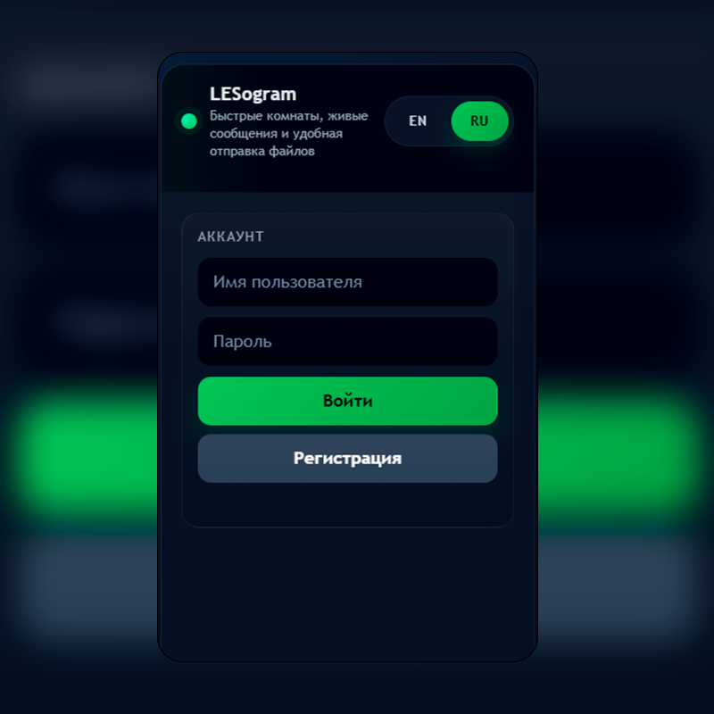
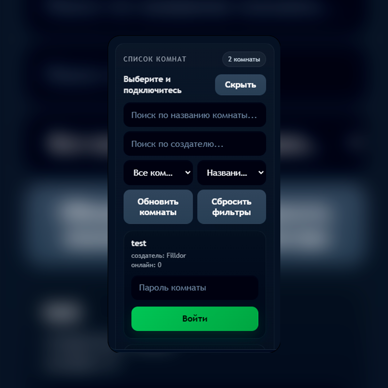
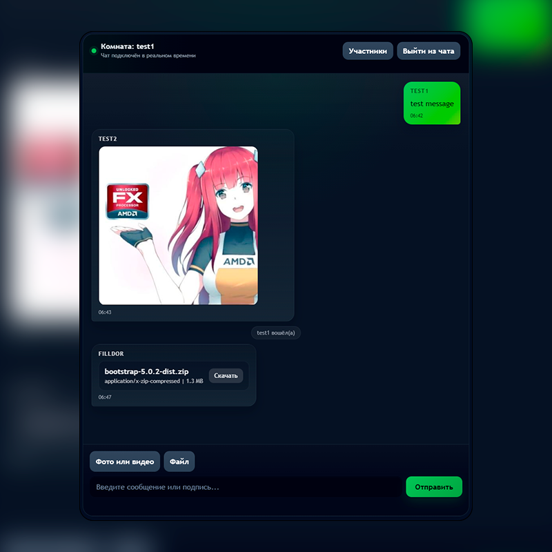
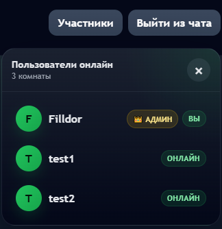

<div align="center">


# 💬 LESogram

**Быстрые комнаты, живые сообщения и удобная отправка файлов**

[](https://www.python.org/)
[](https://fastapi.tiangolo.com/)
[](https://www.sqlite.org/)
[](https://developer.mozilla.org/en-US/docs/Web/API/WebSocket)
[](https://developer.mozilla.org/en-US/docs/Web/JavaScript)
[](https://www.gnu.org/licenses/gpl-3.0)
[](https://pytest.org/)

</div>

---

## 📋 Содержание

- [📖 Описание проекта](#-описание-проекта)
- [✨ Возможности](#-возможности)
- [🛠️ Технологический стек](#️-технологический-стек)
- [📸 Скриншоты](#-скриншоты)
- [🚀 Быстрый старт](#-быстрый-старт)
- [📖 Использование](#-использование)
- [🔌 API-эндпоинты](#-api-эндпоинты)
- [🔒 Безопасность](#-безопасность)
- [🧪 Тестирование](#-тестирование)
- [📁 Структура проекта](#-структура-проекта)
- [📄 Лицензия](#-лицензия)

---

## 📖 Описание проекта

**LESogram** — это современный веб-чат с открытым исходным кодом, построенный на FastAPI и чистом JavaScript. Проект создан как полнофункциональное решение для общения в реальном времени с акцентом на безопасность, производительность и удобство использования.

### 🎯 Цели проекта

- **Простота развёртывания** — запускается одной командой, не требует сложной настройки
- **Безопасность** — многоуровневая защита данных и файлов пользователей
- **Производительность** — асинхронный бэкенд на FastAPI и легковесный фронтенд без фреймворков
- **Кроссплатформенность** — работает на десктопе и мобильных устройствах через браузер
- **Расширяемость** — модульная архитектура позволяет легко добавлять новый функционал

### 🔄 Поток данных

1. **Аутентификация** → Пользователь регистрируется/входит → получает JWT-токен
2. **Комнаты** → Создаёт или присоединяется к комнате → получает `room_token`
3. **Чат** → Устанавливает WebSocket-соединение → отправляет и получает сообщения
4. **Файлы** → Загружает через HTTP → получает подтверждение и URL для скачивания

### 🌟 Ключевые особенности

#### 🔐 Двухуровневая аутентификация

- **Access Token** — для доступа к API (регистрация, комнаты, профиль)
- **Room Token** — для доступа к конкретной комнате (чат, история, файлы)
- Токены подписываются с использованием HS256 и имеют ограниченное время жизни

#### 💬 Реальный время без задержек

- WebSocket-соединение для мгновенной доставки сообщений
- Системные уведомления о входе/выходе пользователей
- Автоматическое определение офлайн-статуса
- Очистка "мёртвых" соединений

#### 🛡️ Многоуровневая защита файлов

- **Белые списки** — разрешены только безопасные типы (изображения, видео, документы)
- **Чёрные списки** — запрещены исполняемые файлы, скрипты, HTML
- **Валидация** — проверка MIME-типа и расширения файла
- **Сохранение** — случайные имена файлов для предотвращения атак
- **Отдача** — проверка `room_token` при скачивании

#### 👑 Ролевая модель

- **Пользователь** — может создавать комнаты, общаться, загружать файлы
- **Администратор** — дополнительно может удалять любые сообщения и комнаты
- Создатель комнаты имеет права на её удаление

#### 🌍 Интернационализация

- Поддержка русского и английского языков
- Переключение "на лету" без перезагрузки
- Локализованы все элементы интерфейса и системные сообщения
- Автоопределение языка браузера при первом запуске

### 📊 Масштабируемость

| Компонент           | Текущая реализация | Возможное расширение |
| :------------------ | :----------------- | :------------------- |
| **База данных**     | SQLite             | PostgreSQL, MySQL    |
| **Хранение файлов** | Локальная папка    | AWS S3, MinIO        |
| **Кеширование**     | In-memory          | Redis                |
| **Очереди**         | Нет                | RabbitMQ, Celery     |
| **Мониторинг**      | Нет                | Prometheus, Grafana  |

### 🎓 Образовательная ценность

Проект отлично подходит для изучения:

- **FastAPI** — современный асинхронный Python-фреймворк
- **WebSocket** — работа с постоянными соединениями
- **JWT** — практика токен-базированной аутентификации
- **SQLAlchemy** — ORM и миграции схемы БД
- **Безопасность** — защита от распространённых веб-уязвимостей
- **Clean JavaScript** — SPA без React/Vue/Angular
- **Тестирование** — написание модульных и интеграционных тестов

### 📈 Дорожная карта

- [ ] Приватные сообщения между пользователями
- [ ] Редактирование сообщений
- [ ] Реакции на сообщения (эмодзи)
- [ ] Поиск по истории сообщений
- [ ] Экспорт чата
- [ ] Тёмная/светлая тема
- [ ] Уведомления на рабочем столе
- [ ] Звуковые уведомления
- [ ] Docker-контейнеризация

## ✨ Возможности

|      🔐 Безопасность       |            💬 Чат             |             📎 Файлы              |        🎨 Интерфейс        |
| :-----------------------: | :--------------------------: | :------------------------------: | :-----------------------: |
|    JWT-аутентификация     | Сообщения в реальном времени | Загрузка фото, видео, документов |     Адаптивный дизайн     |
|    Хеширование паролей    |    Системные уведомления     |    Предпросмотр медиа в чате     |      Поддержка EN/RU      |
|       Rate limiting       |  Защищённые паролем комнаты  | Защищённые ссылки на скачивание  |        Тёмная тема        |
| Проверка WebSocket Origin |  Роли: пользователь / админ  |       Лимит 20 MB на файл        |   Панель администратора   |
| Защита от опасных файлов  | Удаление сообщений и комнат  |    Белые/чёрные списки типов     | Поиск и фильтрация комнат |

---

## 🛠️ Технологический стек

### 🔧 Бэкенд

| Технология                                                | Назначение                   |
| :-------------------------------------------------------- | :--------------------------- |
| **[FastAPI](https://fastapi.tiangolo.com/)**              | Основной веб-фреймворк       |
| **[SQLAlchemy](https://www.sqlalchemy.org/)**             | ORM для работы с БД          |
| **[SQLite](https://www.sqlite.org/)**                     | База данных                  |
| **[python-jose](https://github.com/mpdavis/python-jose)** | Работа с JWT токенами        |
| **[Pwdlib](https://pypi.org/project/pwdlib/)**            | Хеширование паролей (Argon2) |
| **[Uvicorn](https://www.uvicorn.org/)**                   | ASGI-сервер                  |
| **[Pydantic](https://docs.pydantic.dev/)**                | Валидация данных             |

### 🎨 Фронтенд

| Технология                   | Назначение                                    |
| :--------------------------- | :-------------------------------------------- |
| **Чистый JavaScript (ES6+)** | Логика клиентской части                       |
| **HTML5**                    | Структура страниц                             |
| **CSS3**                     | Стилизация (Grid, Flexbox, Custom Properties) |

### 🧪 Тестирование

| Технология                                 | Назначение                 |
| :----------------------------------------- | :------------------------- |
| **[pytest](https://pytest.org/)**          | Фреймворк для тестирования |

---

## 📸 Скриншоты

<details>
<summary>Нажмите, чтобы развернуть</summary>


- Окно регистрации и входа <br>


- Список комнат с фильтрацией <br>


- Чат с сообщениями и медиафайлами <br>


- Попап с пользователями онлайн <br>


</details>

---

## 🚀 Быстрый старт

### 📋 Предварительные требования

- **Python** `3.10` или выше
- **pip** (менеджер пакетов Python)
- **Git** (для клонирования репозитория)

### 🔽 Установка

#### 1️⃣ Клонирование репозитория

```bash
git clone https://github.com/Filldor2033/LESogram.git
cd lesogram
```

#### 2️⃣ Создание виртуального окружения

**Linux / macOS:**

```bash
python -m venv venv
source venv/bin/activate
```

**Windows:**

```bash
python -m venv venv
venv\Scripts\activate
```

#### 3️⃣ Установка зависимостей

```bash
pip install -r requirements.txt
```

#### 4️⃣ Запуск приложения

```bash
uvicorn main:app --reload --host 0.0.0.0 --port 8000
```

#### 5️⃣ Открытие в браузере

Перейдите по адресу: **[http://localhost:8000](http://localhost:8000)**

---

## 📖 Использование

### 🔐 Аутентификация

| Действие        | Описание                                                     |
| :-------------- | :----------------------------------------------------------- |
| **Регистрация** | Создайте аккаунт, указав имя пользователя (3-50 символов) и пароль (4-72 символа) |
| **Вход**        | Войдите в существующий аккаунт для получения токена доступа  |

> 💡 **Примечание:** Первый зарегистрированный пользователь не становится администратором автоматически. Чтобы сделать пользователя администратором, измените поле `is_admin` на `1` в таблице `users` базы данных.

### 🏠 Комнаты

| Действие       | Описание                                                     |
| :------------- | :----------------------------------------------------------- |
| **Создание**   | Нажмите "Create room", указав название (3-100 символов) и пароль (3-72 символа) |
| **Поиск**      | Используйте поля поиска по названию или создателю            |
| **Фильтрация** | Отфильтруйте комнаты: все / с пользователями / пустые        |
| **Сортировка** | Отсортируйте по названию, количеству онлайн или создателю    |
| **Вход**       | Введите пароль комнаты и нажмите "Join"                      |
| **Удаление**   | Доступно создателю комнаты или администратору                |

> 👑 **Администраторы** могут входить в любую комнату без пароля!

### 💬 Чат

| Действие               | Описание                                              |
| :--------------------- | :---------------------------------------------------- |
| **Отправка текста**    | Введите сообщение и нажмите `Enter` или кнопку "Send" |
| **Фото / Видео**       | Нажмите "Photo or video", выберите файл               |
| **Документы**          | Нажмите "File", выберите файл                         |
| **Скачивание**         | Нажмите "Download" на файле в чате                    |
| **Выход**              | Нажмите "Exit chat" для выхода из комнаты             |
| **Удаление сообщений** | Нажмите "Delete" (только для админов)                 |

### 🌍 Смена языка

Нажмите **EN** или **RU** в правом верхнем углу для переключения между английским и русским языками.

---

## 🔌 API-эндпоинты

### 🔑 Аутентификация

| Метод  | Эндпоинт    | Описание                          | Требует токен |
| :----- | :---------- | :-------------------------------- | :-----------: |
| `POST` | `/register` | Регистрация нового пользователя   |       ❌       |
| `POST` | `/login`    | Вход в систему                    |       ❌       |
| `GET`  | `/me`       | Информация о текущем пользователе |   ✅ Bearer    |

### 🏠 Комнаты

| Метод    | Эндпоинт              | Описание                | Требует токен |
| :------- | :-------------------- | :---------------------- | :-----------: |
| `GET`    | `/rooms`              | Список всех комнат      |   ✅ Bearer    |
| `POST`   | `/rooms`              | Создание новой комнаты  |   ✅ Bearer    |
| `POST`   | `/rooms/join`         | Присоединение к комнате |   ✅ Bearer    |
| `GET`    | `/rooms/{room}/users` | Пользователи в комнате  |    ✅ Room     |
| `DELETE` | `/rooms/{room_name}`  | Удаление комнаты        |   ✅ Bearer    |

### 💬 Сообщения

| Метод    | Эндпоинт                 | Описание                          | Требует токен |
| :------- | :----------------------- | :-------------------------------- | :-----------: |
| `GET`    | `/messages/{room}`       | История сообщений (последние 50)  |    ✅ Room     |
| `DELETE` | `/messages/{message_id}` | Удаление сообщения (только админ) |   ✅ Bearer    |

### 📎 Вложения

| Метод  | Эндпоинт                    | Описание                  |  Требует токен  |
| :----- | :-------------------------- | :------------------------ | :-------------: |
| `POST` | `/rooms/{room}/attachments` | Загрузка файла в комнату  | ✅ Bearer + Room |
| `GET`  | `/attachments/{message_id}` | Скачивание/просмотр файла |     ✅ Room      |

### 🔗 WebSocket

| Протокол | Эндпоинт                        | Описание                               |
| :------- | :------------------------------ | :------------------------------------- |
| `WS`     | `/ws/{room}?room_token=<token>` | Соединение для чата в реальном времени |

---

## 🔒 Безопасность

### 🛡️ Реализованные меры защиты

| Мера                            | Описание                                                     |
| :------------------------------ | :----------------------------------------------------------- |
| **JWT-токены**                  | Двухуровневая система: `access_token` для API и `room_token` для комнат |
| **Хеширование паролей**         | Используется алгоритм Argon2 через библиотеку Pwdlib         |
| **Rate limiting**               | Алгоритм скользящего окна, разные лимиты для разных эндпоинтов |
| **WebSocket Origin**            | Проверка Origin заголовка для WebSocket-соединений           |
| **Защита от опасных файлов**    | Чёрный список расширений (`.exe`, `.js`, `.php` и др.) и MIME-типов |
| **Белые списки файлов**         | Разрешены только безопасные типы изображений, видео и документов |
| **Безопасные имена файлов**     | Оригинальные имена очищаются от опасных символов             |
| **Защита от Path Traversal**    | Сохранение файлов со случайными именами, проверка путей при отдаче |
| **HTTP-заголовки безопасности** | CSP, HSTS, X-Content-Type-Options, X-Frame-Options и др.     |
| **Ограничение размера**         | Максимальный размер загружаемого файла: 20 MB                |

### 🚫 Запрещённые типы файлов

<details>
<summary>Список запрещённых расширений (27 типов)</summary>


`.apk` `.app` `.bat` `.cmd` `.com` `.dll` `.exe` `.hta` `.html` `.htm` `.iso` `.jar` `.js` `.jse` `.mjs` `.msi` `.php` `.ps1` `.py` `.scr` `.sh` `.svg` `.vbs` `.xhtml`

</details>

<details>
<summary>Список запрещённых MIME-типов</summary>


- `application/javascript`
- `application/x-msdownload`
- `text/html`
- `text/javascript`
- `image/svg+xml`

</details>

---

## 🧪 Тестирование

### Запуск тестов

```bash
# Запуск всех тестов
pytest

# С подробным выводом
pytest -v

# С отчётом о покрытии
pytest --cov=. --cov-report=html
```

### Структура тестов

| Файл           | Описание                                        |
| :------------- | :---------------------------------------------- |
| `test_auth.py` | Модульные тесты для хеширования паролей и JWT   |
| `test_api.py`  | Интеграционные тесты API и WebSocket            |
| `conftest.py`  | Фикстуры pytest (in-memory БД, тестовый клиент) |

### Покрываемые сценарии

- ✅ Регистрация и вход
- ✅ Обработка дубликатов пользователей
- ✅ Неверные пароли
- ✅ Создание и удаление комнат
- ✅ Присоединение к комнате (верный/неверный пароль)
- ✅ Обмен сообщениями через WebSocket
- ✅ История сообщений
- ✅ Загрузка вложений
- ✅ Удаление сообщений администратором
- ✅ Права доступа (обычный пользователь vs админ)

---

## 📁 Структура проекта

```
LESogram/
│
├── 📂 documentation/
│   ├── 📄 Technical documentation.md    # Техническая документация
│   └── 📄 Technical specification.md    # Техническое задание
│
├── 📂 screenshots/
│   ├── 🖼️ auth.png                      # Скриншот интерфейса регистрации/авторизации
│   ├── 🖼️ chat.png                      # Скриншот основного окна чата с сообщениями
│   ├── 🖼️ rooms.png                     # Скриншот управления комнатами (список, создание, вход)
│   └── 🖼️ users.png                     # Скриншот панели пользователей или администрирования
│
├── 📂 src/
│   ├── 📂 static/
│   │   ├── 📄 index.html                # Главная HTML-разметка фронтенда (структура чата)
│   │   ├── 📄 script.js                 # Клиентская логика: WebSocket-подключения, отправка/приём сообщений, вызовы REST API
│   │   └── 📄 style.css                 # Таблицы стилей для оформления интерфейса
│   │
│   ├── 📂 tests/
│   │   ├── 📄 conftest.py               # Конфигурация pytest: фикстуры для изолированной SQLite БД в памяти
│   │   ├── 📄 test_api.py               # Интеграционные тесты API: регистрация, логин, дубликаты, создание/вход в комнаты, проверка паролей комнат, история сообщений, WebSocket-чат, права админа/создателя на удаление
│   │   ├── 📄 test_auth.py              # Юнит-тесты auth-модуля: хеширование паролей, создание/верификация JWT, обработка невалидных и истёкших токенов
│   │   └── 📄 test_main.py              # Юнит-тесты чистых функций из main.py
│   ├── 📄 auth.py                       # Модуль аутентификации: хеширование паролей, генерация и проверка JWT-токенов, зависимости для получения текущего пользователя
│   ├── 📄 chat.db                       # Файл SQLite-базы данных
│   ├── 📄 database.py                   # Настройка SQLAlchemy: создание engine, сессий, базовый класс моделей (Base)
│   ├── 📄 main.py                       # Точка входа FastAPI: регистрация роутеров, настройка WebSocket, middleware, dependency overrides, запуск uvicorn
│   ├── 📄 models.py                     # ORM-модели SQLAlchemy: таблицы users, rooms, messages и связи между ними
│   └── 📄 schemas.py                    # Pydantic-схемы: валидация входящих JSON (request bodies) и форматирование ответов API (response models)
│
├── 📄 .gitignore                        # Правила Git для игнорирования временных файлов, кэша, venv, локальных БД и секретов
├── 📄 LICENSE                           # Лицензионное соглашение, определяющее условия использования и распространения кода
├── 📄 README.md                         # Основной readme: описание проекта, инструкции по установке, настройке переменных окружения, запуску тестов и деплою
└── 📄 requirements.txt                  # Список Python-зависимостей (FastAPI, SQLAlchemy, python-jose, pytest, и др.)
```

---

## 📄 Лицензия

<div align="center">


Данный проект распространяется под лицензией **GPL-3.0**.

[](https://www.gnu.org/licenses/gpl-3.0)

**© 2026 LESogram**

</div>

---

<div align="center">


### ⭐ Если вам понравился проект, поставьте звёздочку на GitHub!

</div>
