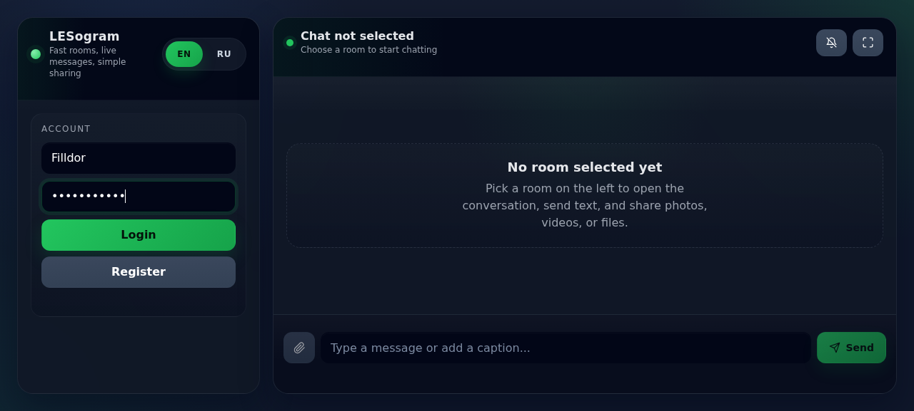
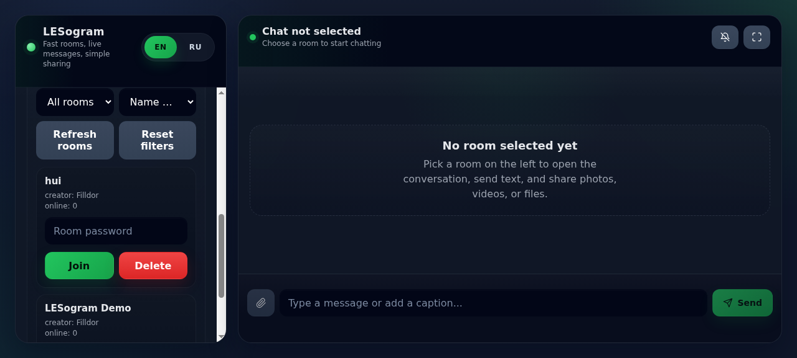
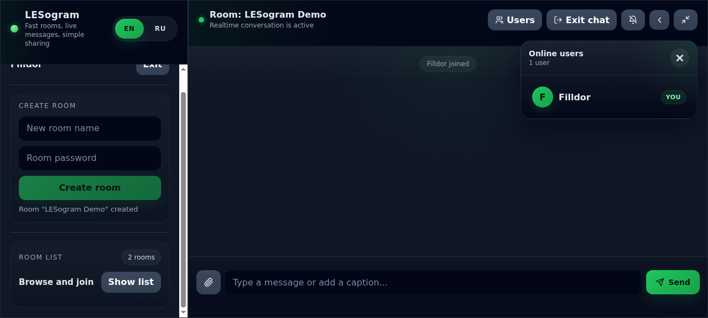
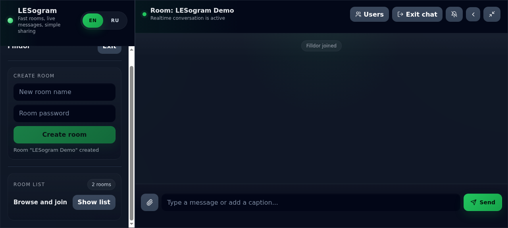

<div align="center">


# 💬 LESogram

**Быстрые комнаты, живые сообщения и удобная отправка файлов**

[](https://www.python.org/)
[](https://fastapi.tiangolo.com/)
[](https://svelte.dev/)
[](https://www.typescriptlang.org/)
[](https://www.sqlite.org/)
[](https://developer.mozilla.org/en-US/docs/Web/API/WebSocket)
[](https://www.gnu.org/licenses/gpl-3.0)
[](https://pytest.org/)

</div>

---

## 📋 Содержание

- [📖 Описание проекта](#-описание-проекта)
- [✨ Возможности](#-возможности)
- [🛠️ Технологический стек](#️-технологический-стек)
- [📸 Скриншоты](#-скриншоты)
- [🚀 Быстрый старт](#-быстрый-старт)
- [📖 Использование](#-использование)
- [🔌 API-эндпоинты](#-api-эндпоинты)
- [🔒 Безопасность](#-безопасность)
- [🧪 Тестирование](#-тестирование)
- [📁 Структура проекта](#-структура-проекта)
- [📄 Лицензия](#-лицензия)

---

## 📖 Описание проекта

**LESogram** — это современный веб-чат с открытым исходным кодом: асинхронный бэкенд на **FastAPI** и реактивный фронтенд на **Svelte 5 + TypeScript**. Проект создан как полнофункциональное решение для общения в реальном времени с акцентом на безопасность, производительность и удобство использования — от десктопа до смартфона.

### 🎯 Цели проекта

- **Простота развёртывания** — запускается одной командой, не требует сложной настройки
- **Безопасность** — многоуровневая защита данных и файлов пользователей
- **Производительность** — асинхронный бэкенд на FastAPI и лёгкий реактивный фронтенд
- **Кроссплатформенность** — адаптивный интерфейс для десктопа и мобильных устройств
- **Расширяемость** — модульная архитектура позволяет легко добавлять новый функционал

### 🔄 Поток данных

1. **Аутентификация** → Пользователь регистрируется/входит → получает JWT `access_token`
2. **Комнаты** → Создаёт или присоединяется к комнате → получает `room_token`
3. **Чат** → Устанавливает WebSocket-соединение → отправляет и получает сообщения, реакции, статусы набора текста
4. **Файлы** → Загружает через HTTP с прогресс-баром → получает подтверждение и URL для скачивания

### 🌟 Ключевые особенности

#### 🔐 Двухуровневая аутентификация

- **Access Token** — для доступа к API (регистрация, комнаты, профиль), живёт 24 часа
- **Room Token** — для доступа к конкретной комнате (чат, история, файлы)
- Токены подписываются с использованием HS256

#### 💬 Реальное время без задержек

- WebSocket-соединение для мгновенной доставки сообщений
- Индикатор «печатает…» в реальном времени
- Системные уведомления о входе/выходе пользователей
- Уведомления об упоминаниях (@username)
- Heartbeat-механизм (пинг каждые 25с, отключение зависших соединений после 75с)
- Очистка «мёртвых» соединений

#### 💬 Богатая работа с сообщениями

- **Реакции** — 6 эмодзи-реакций на любое сообщение (👍 ❤️ 😂 😮 😢 🔥)
- **Ответы** — цитирование сообщения с превью оригинала
- **Редактирование** — автор может изменить своё сообщение (с пометкой «изменено»)
- **Упоминания** — @username с автодополнением и уведомлением адресата
- **Удаление** — администраторы могут удалять любые сообщения

#### 🛡️ Многоуровневая защита файлов

- **Белые списки** — разрешены только безопасные типы (изображения, видео, аудио, документы)
- **Чёрные списки** — запрещены исполняемые файлы, скрипты, HTML
- **Валидация** — проверка MIME-типа и расширения файла
- **Сохранение** — случайные имена файлов для предотвращения атак
- **Отдача** — проверка `room_token` при скачивании
- Лимит загрузки — **50 MB**, изображения декодируются и проверяются (защита от декомпрессионных бомб)

#### 🖥️ Современный интерфейс

- **Свой видеоплеер** — кастомные контролы в фирменном стиле: seek-бар с превью времени и буфером, ±10с, громкость, скорость (1–2×), fullscreen; автоскрытие контролов, горячие клавиши (Space/K, ←/→, J/L, ↑/↓, M, F, 0–9), скачивание видео с оригинальным именем
- **Лайтбокс для фото** — полноэкранный просмотр с зумом (кнопки/колесо/клик), панорамированием, навигацией по всем фото комнаты (←/→), счётчиком и скачиванием
- **Полноэкранный режим** — плавная анимация перехода, сайдбар скрывается/показывается
- **Мобильная версия** — переключение экранов «комнаты ↔ чат» свайп-анимацией, tap-меню вместо контекстного
- **Прогресс-бар загрузки** файлов с возможностью отмены
- **Контекстное меню** сообщений (ПКМ на десктопе, тап на мобильных)
- **Подсветка ответов** — клик по цитате скроллит к сообщению и подсвечивает его пульсирующим свечением
- **Уведомления браузера** — опциональные desktop-уведомления
- **SVG-иконки** — единый набор иконок во всём интерфейсе, золотые админ-бейджи с короной

#### 👑 Ролевая модель

- **Пользователь** — может создавать комнаты, общаться, загружать файлы, редактировать свои сообщения
- **Администратор** — дополнительно может удалять любые сообщения и комнаты, входить в комнаты без пароля, обходит rate-limit
- Создатель комнаты имеет права на её удаление

#### 🌍 Интернационализация

- Поддержка русского и английского языков
- Переключение «на лету» без перезагрузки
- Локализованы все элементы интерфейса, системные сообщения и даже ошибки API (включая ошибки валидации полей)

### 📊 Масштабируемость

| Компонент           | Текущая реализация        | Возможное расширение |
| :------------------ | :------------------------ | :------------------- |
| **База данных**     | SQLite (aiosqlite)        | PostgreSQL, MySQL    |
| **Хранение файлов** | Локальная папка           | AWS S3, MinIO        |
| **Кеширование**     | In-memory                 | Redis                |
| **Очереди**         | Нет                       | RabbitMQ, Celery     |
| **Мониторинг**      | Нет                       | Prometheus, Grafana  |

### 🎓 Образовательная ценность

Проект отлично подходит для изучения:

- **FastAPI** — современный асинхронный Python-фреймворк
- **WebSocket** — работа с постоянными соединениями, heartbeat, broadcast
- **Svelte 5** — руны (`$state`, `$derived`, `$props`), реактивность без виртуального DOM
- **JWT** — практика токен-базированной аутентификации
- **SQLAlchemy 2.0** — асинхронный ORM
- **Безопасность** — защита от распространённых веб-уязвимостей
- **Тестирование** — модульные и интеграционные тесты (включая WebSocket)

### 📈 Дорожная карта

- [x] Приватные сообщения между пользователями → защищённые паролем комнаты
- [x] Редактирование сообщений
- [x] Реакции на сообщения (эмодзи)
- [x] Полноэкранный режим
- [x] Мобильная адаптация
- [x] Уведомления на рабочем столе
- [x] Свой видеоплеер с хоткеями
- [x] Лайтбокс для фотографий
- [ ] Поиск по истории сообщений
- [ ] Экспорт чата
- [ ] Тёмная/светлая тема
- [ ] Звуковые уведомления
- [ ] Docker-контейнеризация

## ✨ Возможности

|      🔐 Безопасность       |             💬 Чат             |              📎 Файлы               |          🎨 Интерфейс           |
| :------------------------: | :----------------------------: | :---------------------------------: | :-----------------------------: |
|    JWT-аутентификация     |     Сообщения в реальном времени     |     Загрузка фото, видео, аудио, документов     |        Адаптивный дизайн        |
|    Хеширование паролей    | Реакции, ответы, редактирование  |  Прогресс-бар с отменой загрузки  |     Мобильная версия (swipe-навигация)     |
|       Rate limiting       |     Упоминания (@username)      |    Свой видеоплеер с хоткеями и скачиванием    |     Лайтбокс для фото (зум, навигация)     |
|       Защищённые паролем комнаты      |   Индикатор «печатает…»   |    Предпросмотр медиа в чате       |     Полноэкранный режим (анимация)     |
| Проверка WebSocket Origin | Уведомления об упоминаниях |       Белые/чёрные списки типов     | Desktop-уведомления, SVG-иконки |

---

## 🛠️ Технологический стек

### 🔧 Бэкенд

| Технология                                                | Назначение                        |
| :-------------------------------------------------------- | :-------------------------------- |
| **[FastAPI](https://fastapi.tiangolo.com/)**              | Основной асинхронный веб-фреймворк |
| **[SQLAlchemy 2.0](https://www.sqlalchemy.org/)**         | Асинхронный ORM (asyncio)         |
| **[SQLite](https://www.sqlite.org/)** + aiosqlite         | База данных                       |
| **[python-jose](https://github.com/mpdavis/python-jose)** | Работа с JWT-токенами             |
| **[Pwdlib](https://pypi.org/project/pwdlib/)**            | Хеширование паролей (Argon2)      |
| **[Uvicorn](https://www.uvicorn.org/)**                   | ASGI-сервер                       |
| **[Pydantic](https://docs.pydantic.dev/)**                | Валидация данных                  |
| **[Pillow](https://python-pillow.org/)**                  | Проверка изображений              |
| **[aiofiles](https://github.com/Tinche/aiofiles)**        | Асинхронная запись файлов         |

### 🎨 Фронтенд

| Технология                                              | Назначение                                        |
| :------------------------------------------------------ | :------------------------------------------------ |
| **[Svelte 5](https://svelte.dev/)**                    | UI-фреймворк (руны `$state`, `$derived`, `$props`) |
| **[TypeScript](https://www.typescriptlang.org/)**      | Типизация всей клиентской логики                  |
| **[Vite 8](https://vite.dev/)**                        | Сборка и dev-сервер с прокси на бэкенд            |
| **svelte-check**                                        | Статическая проверка типов компонентов            |

### 🧪 Тестирование

| Технология                                 | Назначение                 |
| :----------------------------------------- | :------------------------- |
| **[pytest](https://pytest.org/)**          | Фреймворк для тестирования |
| **pytest-asyncio**                         | Асинхронные тесты          |
| **[httpx](https://www.python-httpx.org/)** | HTTP-клиент для интеграционных тестов |

---

## 📸 Скриншоты

<details>
<summary>Нажмите, чтобы развернуть</summary>


- Вход и регистрация <br>


- Список комнат с фильтрацией <br>


- Чат с сообщениями, фото и видео <br>


- Попап с пользователями онлайн <br>


- Полноэкранный режим <br>


</details>

---

## 🚀 Быстрый старт

### 📋 Предварительные требования

- **Python** `3.10` или выше
- **Node.js** `18` или выше (для сборки фронтенда)
- **pip** (менеджер пакетов Python)
- **Git** (для клонирования репозитория)

### 🔽 Установка

#### 1️⃣ Клонирование репозитория

```bash
git clone https://github.com/Filldor2033/LESogram.git
cd LESogram
```

#### 2️⃣ Сборка фронтенда (Svelte → dist/)

```bash
cd frontend
npm install
npm run build        # прод-сборка в frontend/dist
```

> 💡 Для разработки: `npm run dev` поднимет Vite на `http://localhost:5173` с прокси `/api` и `/ws` на бэкенд.

#### 3️⃣ Создание виртуального окружения

**Linux / macOS:**

```bash
cd ..
python -m venv venv
source venv/bin/activate
```

**Windows:**

```bash
python -m venv venv
venv\Scripts\activate
```

#### 4️⃣ Установка зависимостей

```bash
pip install -r requirements.txt
```

#### 5️⃣ Запуск приложения

```bash
cd src
uvicorn main:app --reload --host 0.0.0.0 --port 8000
```

#### 6️⃣ Открытие в браузере

Перейдите по адресу: **[http://localhost:8000](http://localhost:8000)**

- `/` — новый Svelte-интерфейс
- `/legacy` — старый JS-интерфейс (для сравнения)
- `/docs` — автодокументация OpenAPI

> ⚠️ Если фронтенд не собран (`frontend/dist` отсутствует), `/` автоматически отдаст legacy-версию.

---

## 📖 Использование

### 🔐 Аутентификация

| Действие        | Описание                                                     |
| :-------------- | :----------------------------------------------------------- |
| **Регистрация** | Создайте аккаунт, указав имя пользователя (3–50 символов: буквы латиницы/кириллицы, цифры, `_ . -` и пробелы) и пароль (4–72 символа) |
| **Вход**        | Войдите в существующий аккаунт для получения токена доступа  |

> 💡 При неудачной регистрации форма показывает конкретную причину (слишком короткий логин, недопустимые символы и т.д.) и блок с требованиями к логину и паролю.

> 👑 **Администраторы:** первый зарегистрированный пользователь не становится администратором автоматически. Чтобы сделать пользователя администратором, измените поле `is_admin` на `1` в таблице `users` базы данных.

### 🏠 Комнаты

| Действие       | Описание                                                     |
| :------------- | :----------------------------------------------------------- |
| **Создание**   | Нажмите "Create room", указав название (3–100 символов) и пароль (3–72 символа) |
| **Поиск**      | Используйте поля поиска по названию или создателю            |
| **Фильтрация** | Отфильтруйте комнаты: все / с пользователями / пустые        |
| **Сортировка** | Отсортируйте по названию, количеству онлайн или создателю    |
| **Вход**       | Введите пароль комнаты и нажмите "Join"                      |
| **Удаление**   | Доступно создателю комнаты или администратору                |

> 👑 **Администраторы** могут входить в любую комнату без пароля!

### 💬 Чат

| Действие                 | Описание                                                       |
| :----------------------- | :------------------------------------------------------------- |
| **Отправка текста**      | Введите сообщение и нажмите `Enter` или кнопку со стрелкой     |
| **Реакции / Ответ / Редактирование** | ПКМ по сообщению (или тап на мобильном) → контекстное меню |
| **Переход к ответу**     | Клик по цитате → скролл к сообщению + зелёная подсветка        |
| **Упоминания**           | Введите `@` и начните печатать имя — появится автодополнение   |
| **Фото**                 | Клик по фото → лайтбокс: зум, панорамирование, ←/→ между фото  |
| **Видео**                | Свой плеер: клик = пауза, двойной клик = fullscreen            |
| **Хоткеи плеера**        | `Space`/`K` play-pause · `←`/`→` ±5с · `J`/`L` ±10с · `↑`/`↓` громкость · `M` mute · `F` fullscreen · `0–9` переход |
| **Фото / Видео / Файл**  | Кнопка со скрепкой → выбор файла → прогресс-бар с отменой      |
| **Полноэкранный режим**  | Кнопка «Expand» в тулбаре чата (только десктоп)                |
| **Онлайн-пользователи**  | Кнопка с иконкой людей в тулбаре чата                          |
| **Уведомления**          | Кнопка колокольчика включает desktop-уведомления               |
| **Выход**                | Нажмите "Exit chat" для выхода из комнаты                     |

### 📱 Мобильная версия

Интерфейс автоматически перестраивается на узких экранах:

- Два экрана вместо колонок: **список комнат ↔ чат** с анимированным переключением
- Кнопка «назад» в чате для возврата к списку комнат
- **Тап по сообщению** открывает контекстное меню (вместо ПКМ)

### 🌍 Смена языка

Нажмите **EN** или **RU** в правом верхнем углу для переключения между английским и русским языками.

---

## 🔌 API-эндпоинты

> Новый фронтенд обращается к REST-эндпоинтам с префиксом `/api/*`. Все эндпоинты также доступны без префикса (для совместимости). WebSocket всегда без префикса.

### 🔑 Аутентификация

| Метод  | Эндпоинт          | Описание                          | Требует токен |
| :----- | :---------------- | :-------------------------------- | :-----------: |
| `POST` | `/api/register`   | Регистрация нового пользователя   |       ❌       |
| `POST` | `/api/login`      | Вход в систему                    |       ❌       |
| `GET`  | `/api/me`         | Информация о текущем пользователе |   ✅ Bearer    |

### 🏠 Комнаты

| Метод    | Эндпоинт                    | Описание                                | Требует токен |
| :------- | :-------------------------- | :-------------------------------------- | :-----------: |
| `GET`    | `/api/rooms`                | Список всех комнат                      |   ✅ Bearer    |
| `POST`   | `/api/rooms`                | Создание новой комнаты                  |   ✅ Bearer    |
| `POST`   | `/api/rooms/join`           | Присоединение к комнате (даёт room_token) |  ✅ Bearer |
| `GET`    | `/api/rooms/{room}/users`   | Пользователи в комнате                  |    ✅ Room     |
| `DELETE` | `/api/rooms/{room_name}`    | Удаление комнаты (создатель/админ)      |   ✅ Bearer    |

### 💬 Сообщения

| Метод     | Эндпоинт                                | Описание                                   | Требует токен |
| :-------- | :-------------------------------------- | :----------------------------------------- | :-----------: |
| `GET`     | `/api/messages/{room}`                  | История сообщений (последние 50)           |    ✅ Room     |
| `DELETE`  | `/api/messages/{message_id}`            | Удаление сообщения (только админ)          |   ✅ Bearer    |
| `PATCH`   | `/api/messages/{message_id}`            | Редактирование своего сообщения            |   ✅ Bearer    |
| `POST`    | `/api/messages/{message_id}/reactions`  | Поставить/убрать реакцию (6 эмодзи)        |   ✅ Bearer    |

### 📎 Вложения

| Метод  | Эндпоинт                        | Описание                                |    Требует токен    |
| :----- | :------------------------------ | :-------------------------------------- | :-----------------: |
| `POST` | `/api/rooms/{room}/attachments` | Загрузка файла в комнату (до 50 MB)     | ✅ Bearer + Room    |
| `GET`  | `/attachments/{message_id}`     | Скачивание/просмотр файла               |      ✅ Room        |

### 🔗 WebSocket

| Протокол | Эндпоинт                        | Описание                               |
| :------- | :------------------------------ | :------------------------------------- |
| `WS`     | `/ws/{room}?room_token=<token>` | Соединение для чата в реальном времени |

Протокол сообщений клиента → сервер:

```jsonc
{ "type": "message",  "text": "привет", "reply_to_id": 12 }  // сообщение (опц. ответ)
{ "type": "typing" }                                          // статус «печатает…»
```

Сервер → клиент: `message`, `system` (вход/выход), `typing`, `mention`, `edit`, `delete`, `reaction`.

---

## 🔒 Безопасность

### 🛡️ Реализованные меры защиты

| Мера                            | Описание                                                     |
| :------------------------------ | :----------------------------------------------------------- |
| **JWT-токены**                  | Двухуровневая система: `access_token` для API и `room_token` для комнат |
| **Хеширование паролей**         | Используется алгоритм Argon2 через библиотеку Pwdlib         |
| **Rate limiting**               | Скользящее окно с разными лимитами: register 8/мин, login 10/мин, создание комнат и загрузка файлов 20/5мин, правка сообщений 60/мин, реакции 120/мин, burst-защита WebSocket 5 сообщений/3с |
| **WebSocket Origin**            | Проверка Origin заголовка для WebSocket-соединений           |
| **Защита от опасных файлов**    | Чёрный список расширений (`.exe`, `.js`, `.php` и др.) и MIME-типов |
| **Белые списки файлов**         | Разрешены только безопасные типы изображений, видео, аудио и документов |
| **Проверка изображений**        | Декодирование через Pillow, лимит 20 Мп (защита от декомпрессионных бомб) |
| **Безопасные имена файлов**     | Файлы сохраняются со случайными именами                      |
| **Защита от Path Traversal**    | Проверка путей при отдаче файлов                             |
| **HTTP-заголовки безопасности** | CSP, HSTS, X-Content-Type-Options, X-Frame-Options и др.     |
| **Ограничение размера**         | Максимальный размер загружаемого файла: 50 MB                |
| **Валидация входных данных**    | Pydantic-схемы на всех эндпоинтах, строгие регулярные выражения для имён |

### 🚫 Запрещённые типы файлов

<details>
<summary>Список запрещённых расширений (24 типа)</summary>


`.apk` `.app` `.bat` `.cmd` `.com` `.dll` `.exe` `.hta` `.html` `.htm` `.iso` `.jar` `.js` `.jse` `.mjs` `.msi` `.php` `.ps1` `.py` `.scr` `.sh` `.svg` `.vbs` `.xhtml`

</details>

<details>
<summary>Список запрещённых MIME-типов</summary>


- `application/javascript`
- `application/x-msdownload`
- `application/x-msdos-program`
- `application/x-executable`
- `text/html`
- `text/javascript`
- `image/svg+xml`

</details>

### ✅ Разрешённые типы файлов

<details>
<summary>Разрешённые категории</summary>


- **Изображения:** JPEG, PNG, WebP, GIF
- **Видео:** MP4, WebM, QuickTime
- **Аудио:** MP3, WAV, OGG, WebM, AAC, FLAC, M4A
- **Документы:** PDF, TXT, CSV, JSON, ZIP, 7z, RAR, DOC(X), XLS(X), PPT(X)

</details>

---

## 🧪 Тестирование

### Запуск тестов

```bash
cd src

# Запуск всех тестов
pytest

# С подробным выводом
pytest -v

# С отчётом о покрытии
pytest --cov=. --cov-report=html
```

### Структура тестов

| Файл                   | Описание                                              |
| :--------------------- | :---------------------------------------------------- |
| `tests/conftest.py`    | Фикстуры pytest (in-memory БД, тестовый клиент)       |
| `tests/helpers.py`     | Вспомогательные функции для тестов                    |
| `tests/test_auth.py`   | Хеширование паролей и JWT                             |
| `tests/test_routes.py` | Интеграционные тесты REST API                         |
| `tests/test_rooms.py`  | Комнаты: создание, вход, права на удаление            |
| `tests/test_messages.py` | Сообщения: история, редактирование, реакции         |
| `tests/test_uploads.py`  | Загрузка файлов: валидация, лимиты, опасные типы    |
| `tests/test_ws_manager.py` | WebSocket-менеджер: подключения, broadcast        |
| `tests/test_security.py` | Заголовки безопасности и Origin-проверка            |
| `tests/test_rate_limit.py` | Rate limiting                                   |

Тесты запускаются автоматически в GitHub Actions при каждом пуше (`.github/workflows/tests.yml`).

### Покрываемые сценарии

- ✅ Регистрация и вход
- ✅ Обработка дубликатов пользователей
- ✅ Неверные пароли
- ✅ Создание и удаление комнат
- ✅ Присоединение к комнате (верный/неверный пароль)
- ✅ Обмен сообщениями через WebSocket
- ✅ История сообщений
- ✅ Редактирование и реакции
- ✅ Загрузка вложений (валидные/запрещённые типы, лимит размера)
- ✅ Удаление сообщений администратором
- ✅ Права доступа (обычный пользователь vs админ)
- ✅ Rate limiting

---

## 📁 Структура проекта

```
LESogram/
│
├── 📂 documentation/
│   ├── 📄 Technical documentation.md    # Техническая документация
│   └── 📄 Technical specification.md    # Техническое задание
│
├── 📂 screenshots/                      # Скриншоты интерфейса
│
├── 📂 src/                              # Бэкенд (FastAPI)
│   ├── 📂 api/                          # REST-роутеры
│   │   ├── 📄 auth_routes.py            #   регистрация, вход, /me
│   │   ├── 📄 room_routes.py            #   комнаты: список, создание, вход, удаление
│   │   ├── 📄 message_routes.py         #   сообщения: история, удаление, правка, реакции
│   │   └── 📄 attachment_routes.py      #   файлы: загрузка и скачивание
│   │
│   ├── 📂 core/                         # Инфраструктура
│   │   ├── 📄 config.py                 #   константы, лимиты, белые/чёрные списки
│   │   ├── 📄 lifespan.py               #   запуск/остановка приложения
│   │   ├── 📄 rate_limit.py             #   rate limiting (скользящее окно)
│   │   ├── 📄 schema_migrations.py      #   миграции SQLite-схемы
│   │   └── 📄 security_headers.py       #   HTTP-заголовки безопасности
│   │
│   ├── 📂 services/                     # Бизнес-логика
│   │   ├── 📄 rooms.py                  #   room_token, участники, системные сообщения
│   │   ├── 📄 messages.py               #   отправка, редактирование, реакции
│   │   ├── 📄 uploads.py                #   валидация и сохранение файлов
│   │   ├── 📄 permissions.py            #   проверки прав (админ/создатель)
│   │   └── 📄 parse.py                  #   парсинг упоминаний
│   │
│   ├── 📂 ws/                           # WebSocket-слой
│   │   ├── 📄 routes.py                 #   подключение, аутентификация, origin-проверка
│   │   ├── 📄 events.py                 #   обработка событий (message, typing)
│   │   ├── 📄 manager.py                #   менеджер соединений, broadcast
│   │   └── 📄 heartbeat.py              #   пинг/таймаут зависших соединений
│   │
│   ├── 📂 static/                       # Legacy-фронтенд (доступен на /legacy)
│   │
│   ├── 📂 tests/                        # pytest-тесты (см. раздел «Тестирование»)
│   │
│   ├── 📄 auth.py                       # JWT: создание/проверка токенов, хеширование
│   ├── 📄 database.py                   # SQLAlchemy: engine, сессии, Base
│   ├── 📄 main.py                       # Точка входа FastAPI: роутеры, SPA-статика
│   ├── 📄 models.py                     # ORM-модели: users, rooms, messages, reactions
│   └── 📄 schemas.py                    # Pydantic-схемы запросов/ответов
│
├── 📂 frontend/                         # Фронтенд (Svelte 5 + TypeScript + Vite)
│   ├── 📂 src/
│   │   ├── 📂 components/               #   UI-компоненты по зонам
│   │   │   ├── 📂 auth/                 #     панель входа/регистрации
│   │   │   ├── 📂 rooms/                #     список, фильтры, создание комнат
│   │   │   ├── 📂 chat/                 #     топбар, список сообщений, контекстное меню,
│   │   │   │                            #     реакции, ответы, редактор, индикатор typing,
│   │   │   │                            #     видеоплеер (VideoPlayer) и лайтбокс (Lightbox)
│   │   │   ├── 📂 composer/             #     ввод сообщения, превью вложений, упоминания
│   │   │   ├── 📂 users/                #     попап онлайн-участников
│   │   │   └── 📂 common/               #     Icon, LanguageSwitch, NotificationButton
│   │   │
│   │   ├── 📂 lib/
│   │   │   ├── 📂 api/                  #     HTTP-клиент: auth, rooms, messages, reactions, attachments
│   │   │   ├── 📂 realtime/             #     WebSocket-клиент с reconnect
│   │   │   ├── 📂 services/             #     chat-session, message-actions
│   │   │   ├── 📂 state/                #     svelte-стейты (auth, chat, composer, ui, ...)
│   │   │   ├── 📂 i18n/                 #     переводы EN/RU + переводчик ошибок API
│   │   │   ├── 📂 types/                #     TS-типы (Message, Room, WebSocket-события)
│   │   │   └── 📂 utils/                #     файлы, время, упоминания
│   │   │
│   │   ├── 📄 App.svelte                #   корневой компонент
│   │   └── 📄 app.css                   #   глобальные стили и анимации
│   │
│   ├── 📄 vite.config.ts                #   сборка, dev-прокси /api и /ws на :8000
│   └── 📄 package.json
│
├── 📂 .github/workflows/                # CI: pytest на каждый пуш
├── 📄 .gitignore
├── 📄 LICENSE                           # GPL-3.0
├── 📄 README.md
└── 📄 requirements.txt                  # Python-зависимости
```

---

## 📄 Лицензия

<div align="center">


Данный проект распространяется под лицензией **GPL-3.0**.

[](https://www.gnu.org/licenses/gpl-3.0)

**© 2026 LESogram**

</div>

---

<div align="center">


### ⭐ Если вам понравился проект, поставьте звёздочку на GitHub!

</div>
